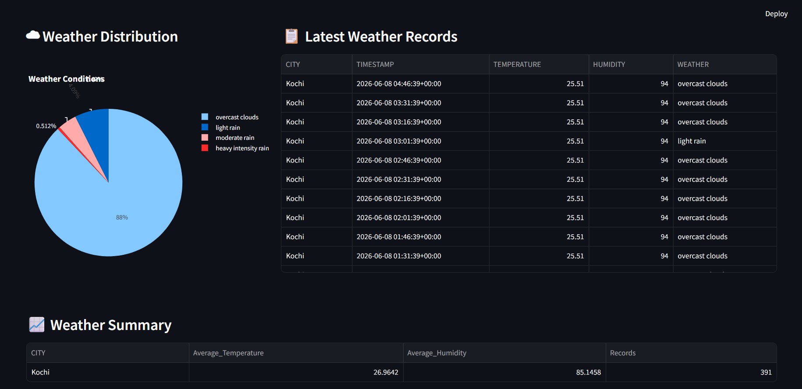
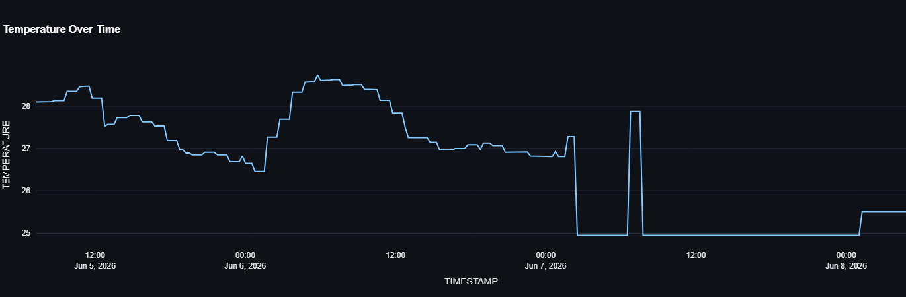
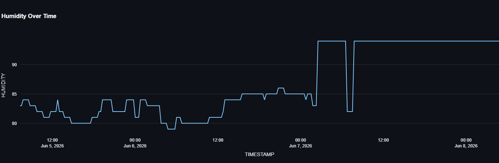

# Real-Time Weather Data Pipeline with AWS, Snowflake, and Streamlit

## Project Overview

This project implements a real-time weather data pipeline that collects weather information from the OpenWeather API, processes it using AWS services, stores raw data in Amazon S3, automatically ingests data into Snowflake using Snowpipe Auto-Ingest, and visualizes insights through a Streamlit dashboard.

---

## Architecture

OpenWeather API

↓

Amazon EventBridge (Scheduled Trigger - Every 15 Minutes)

↓

AWS Lambda (Weather Data Collection)

↓

Amazon DynamoDB

↓

DynamoDB Streams

↓

AWS Lambda (Data Transformation)

↓

Amazon S3 (JSON Storage)

↓

Snowpipe Auto-Ingest

↓

Snowflake Data Warehouse

↓

Streamlit Dashboard

---

## Technologies Used

### AWS

* Amazon EventBridge
* AWS Lambda
* Amazon DynamoDB
* DynamoDB Streams
* Amazon S3
* Amazon SQS (Snowflake-managed notification channel)

### Data Warehouse

* Snowflake
* Snowpipe Auto-Ingest
* External Stage
* Storage Integration

### Visualization

* Streamlit
* Plotly
* Pandas

### Programming Language

* Python

---

## Data Flow

### Step 1: Weather Collection

EventBridge triggers a Lambda function every 15 minutes.

The Lambda function:

* Calls the OpenWeather API
* Fetches weather data for Kochi
* Stores the latest weather record in DynamoDB

### Step 2: Stream Processing

DynamoDB Streams capture newly inserted records.

A second Lambda function:

* Reads stream events
* Converts records into JSON format
* Stores JSON files in Amazon S3

### Step 3: Snowflake Ingestion

Snowflake Storage Integration provides secure access to S3.

An External Stage references the S3 bucket.

Snowpipe is configured with:

AUTO_INGEST = TRUE

When a new JSON file arrives in S3:

* S3 sends an event notification
* Snowflake-managed SQS receives the notification
* Snowpipe automatically loads the file into Snowflake


### Step 4: Analytics & Visualization

A Streamlit dashboard connects to Snowflake and displays:

* Latest Weather Information
* Temperature Trends
* Humidity Trends
* Historical Weather Records
* Summary Statistics

---

## Streamlit Dashboard

The Streamlit dashboard provides real-time visibility into weather data stored in Snowflake.

### Dashboard Features

#### Current Weather Overview

Displays the most recent weather observation including:

* City
* Temperature
* Humidity
* Weather Condition
* Timestamp

#### Temperature Trend Analysis

Interactive line chart showing temperature variations over time.

#### Humidity Trend Analysis

Interactive line chart visualizing humidity fluctuations.

#### Historical Weather Records

Tabular view of weather records retrieved from Snowflake.

#### Summary Statistics

Displays:

* Average Temperature
* Average Humidity
* Minimum Temperature
* Maximum Temperature
* Total Records Processed

### Dashboard Workflow

Snowflake → Streamlit → Interactive Visualizations

The dashboard establishes a secure connection to Snowflake, retrieves weather data using SQL queries, processes the data using Pandas, and generates interactive visualizations for monitoring weather trends in near real-time.

### Dashboard Technologies

* Streamlit
* Snowflake Connector for Python
* Pandas
* Plotly

### Dashboard Screenshot

Add dashboard screenshots in the `/screenshots` folder and reference them below:








## Snowflake Components

### Database

WEATHER_DB

### Schema

RAW

### Table

WEATHER_DATA

### Storage Integration

S3_WEATHER_INTEGRATION

### External Stage

WEATHER_S3_STAGE

### Snowpipe

WEATHER_PIPE

Configured using:

AUTO_INGEST = TRUE

---

## Key Features

* Fully automated weather data pipeline
* Near real-time ingestion into Snowflake
* Event-driven architecture
* Automated Snowpipe loading
* Cloud-native implementation
* Interactive Streamlit dashboard
* End-to-end AWS integration

---

## Verification Queries

```sql
SELECT COUNT(*) FROM WEATHER_DATA;

SELECT MAX(TIMESTAMP) FROM WEATHER_DATA;

SELECT SYSTEM$PIPE_STATUS('WEATHER_PIPE');

SELECT *
FROM WEATHER_DATA
ORDER BY TIMESTAMP DESC
LIMIT 10;
```

## Project Outcome

Successfully implemented a real-time weather data engineering pipeline using AWS, Snowflake, and Streamlit.

The system automatically collects, processes, stores, ingests, and visualizes weather data without manual intervention.
